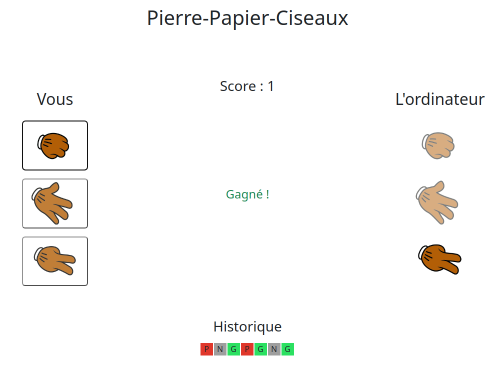

# [EN] Rock-Paper-Scissors

Rock-Paper-Scissors is a fun and classic game in which two players choose between rock, paper or scissors.

## Rules of the game

- Rock beats scissors
- Paper beats rock
- Scissors beats paper

## Purpose of the game and features

The game consists of playing several rounds until a player reaches a score of 3. If a player reaches a score of -3, he loses the game.
The game also includes a history of previous rounds, which is displayed after each round. You can see the choices of each player and the result of the round.

## How to win?

The player must win 5 consecutive rounds to win the game. Once the game is over,
a win/loss message will be displayed and a new game will start when the player is ready.

**Have fun!**

# [FR] Pierre-Papier-Ciseaux

Pierre-Papier-Ciseaux est un jeu amusant et classique dans lequel deux joueurs choisissent entre pierre, papier ou ciseaux.

## Règles du jeu

- La pierre bat les ciseaux
- Le papier bat la pierre
- Les ciseaux bat le papier

## But du jeu et fonctinnalités

Le jeu consiste à jouer plusieurs manches jusqu'à ce qu'un joueur atteigne un score de 3. Si un joueur atteint un score de -3, il perd la partie.
Historique des manches

Le jeu inclut également un historique des manches précédentes, qui s'affiche après chaque manche. Vous pouvez donc voir les choix de chaque joueur ainsi que le résultat de la manche.

## Comment gagner ?

Le joueur doit gagner 5 manches consécutives pour gagner la partie. Une fois la partie terminée,
un message signalant la victoire ou la défaite s'affiche et une nouvelle partie redémarre quand le joueur est prêt.

**Amusez-vous bien !**

